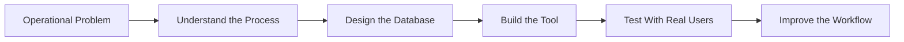

<div align="center">


# Hi, I'm Harry 👋

### Business Systems & Operational Improvement Lead

#### Hobby developer building practical tools for real business problems

<p align="center">
  
</p>

<p align="center>
  <a href="https://www.linkedin.com/in/harry-gomm-aciphe-30832b233/">
    
  </a>
  <a href="https://www.harrygomm.co.uk">
    
  </a>
</p>


---

## About Me

I work in business systems, operational improvement and process development, with a background in the construction industry.

I am not a full-time professional programmer, but I enjoy building software as a hobby to solve real operational problems. Most of my projects are focused on improving workflows, replacing inefficient spreadsheets, managing data properly and creating better internal tools.

## What I’m Currently Working On

<table>
  <tr>
    <td width="33%">
      <h3>Building Heat Loss App</h3>
      <p>A private application for calculating building heat loss and supporting more consistent heating system design.</p>
      <p><strong>Focus:</strong> Python, SQL, technical calculations, process standardisation</p>
    </td>
    <td width="33%">
      <h3>NCR Tracking App</h3>
      <p>A private non-conformance reporting system for recording, managing, reviewing and closing out NCRs.</p>
      <p><strong>Focus:</strong> PostgreSQL, reporting, workflow improvement, quality control</p>
    </td>
    <td width="33%">
      <h3>CTkDataTable</h3>
      <p>A public Python module for creating cleaner table and data grid interfaces in CustomTkinter.</p>
      <p><strong>Focus:</strong> Python, CustomTkinter, UI components, reusable modules</p>
      <p>
  <a href="https://pypi.org/project/CTkDataTable/">
    
  </a>
  <a href="https://pypi.org/project/CTkDataTable/">
    
  </a>
</p>
  </tr>
</table>

---

## How I Think About Software



I like building software around real problems first. For me, the best tools are not just technically interesting — they make work clearer, faster and easier to manage.

---

### Building Heat Loss Calculation Application

An app to calculate a buildings heat loss in accordance with the latest environmental and building science (BS EN 12831-1)

### NCR Tracking & Reporting Application

A non-conformance reporting system designed to replace spreadsheet-based tracking and provide a better way to record, manage, review and close out NCRs.

### CTkDataTable

A public Python module for creating better table/data grid interfaces in CustomTkinter.

<p>
  <a href="https://pypi.org/project/CTkDataTable/">
    
  </a>
  <a href="https://pypi.org/project/CTkDataTable/">
    
  </a>
</p>

---

## Tech Stack

<div align="center">


</div>

<br>

<p align="center">
  
  
  
  
  
  
  
</p>

---

## Areas I’m Interested In

* Business systems and operational improvement
* Building software tools
* Database design and reporting
* Process automation
* Renewable energy and Heating System Design / Engineering

---

## Featured Project

### CTkDataTable

`CTkDataTable` is a Python module for creating cleaner and more practical data tables in CustomTkinter applications.

It was created because standard Tkinter table options can feel limited when building modern desktop applications. The aim is to make it easier to display structured data in a more usable and professional way.

This project was a vibe coded project to assist me in my other projects. 

```bash
pip install CTkDataTable
```

View on PyPI:
https://pypi.org/project/CTkDataTable/

---

## GitHub Activity

<div align="center">


<br><br>


<br><br>


</div>

---

## Current Focus

I am currently focused on improving my Python development skills and building practical applications that support business operations, data management and internal process improvement.

My goal is to keep learning by building useful tools that solve real problems.

---

## Connect With Me

<p align="center">
  <a href="https://www.linkedin.com/in/harry-gomm-aciphe-30832b233/">
    
  </a>
  <a href="https://www.harrygomm.co.uk">
    
  </a>
</p>

---

<div align="center">

### Building practical systems, learning by doing, and improving how work gets done.

</div>


